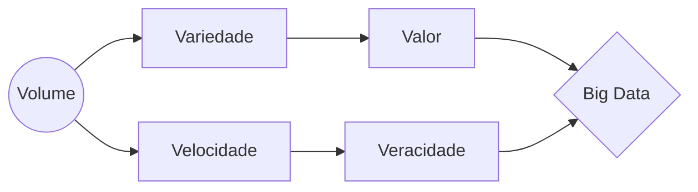

## Big data
### O que é e qual sua importância? 

Big data é um termo que descreve o grande volume de dados tanto estruturados quanto não estruturados  que impactam as empresas diariamente. Mas não é a quantidade de dados disponíveis que importa; é o que as organizações fazem com eles. Big data pode ser analisado para obter insights que levam a decisões melhores e ações estratégicas de negócio.

<a href="#" class="btn">História</a>
 
<a href="#" class="btn">Importância</a>
 
<a href="#" class="btn">Quem usa</a>
 
<a href="#" class="btn">Como funciona</a>

### História e considerações atuais de big data

Embora o termo "big data" seja relativamente novo, o ato de coletar e armazenar grandes quantidades de informações para análises eventuais é muito antiga. O conceito ganhou força no começo dos anos 2000, quando o analista Doug Laney articulou a definição [atualmente mainstream] de big data em três Vs:

**Volume.** Organizações coletam dados de fontes variadas, incluindo transações financeiras, redes sociais e informações de sensores ou dados transmitidos de máquina para máquina. No passado, armazená-los teria sido um problema mas novas tecnologias [como o Hadoop](http://hadoop.apache.org) aliviaram esse fardo.

**Velocidade.** Os dados são transmitidos numa velocidade sem precedentes e devem ser tratados em tempo hábil. Etiquetas RFID, sensores e medições inteligentes estão impulsionando a necessidade de lidar com torrentes de dados praticamente em tempo real.

**Variedade.** Dados são gerados em inúmeros formatos — desde estruturados (numéricos, em databases tradicionais) a não-estruturados (documentos de texto, e-mail, vídeo, áudio, cotações da bolsa e transações financeiras).

**Veracidade.** Um dos pontos mais importantes de qualquer informação é que ela seja verdadeira. Com o Big Data não é possível controlar cada hashtag do Twitter ou notícia falsa na internet, mas com análises e estatísticas de grandes volumes de dados é possível compensar as informações incorretas.

**Valor.** O último V é o que torna Big Data relevante: tudo bem ter acesso a uma quantidade massiva de informação a cada segundo, mas isso não adianta nada se não puder gerar valor. É importante que empresas entrem no negócio do Big Data, mas é sempre importante lembrar dos custos e benefícios e tentar agregar valor ao que se está fazendo.

### O grande potencial do big data

A quantidade de dados criados e armazenados globalmente é quase inimaginável e apenas continua a crescer. Isso significa que há ainda mais potencial para extrair insights importantes dessas informações — embora apenas uma pequena porcentagem de dados seja realmente analisada. O que isso significa para as empresas? Como elas podem fazer um uso melhor dessas informações brutas que fluem para dentro de suas paredes todos os dias?

### Qual é a importância do big data?

A importância do big data não gira em torno da quantidade de dados disponíveis para você, mas do que você faz com esses dados. Você pode obter dados de várias fontes e analisá-los para encontrar respostas que permitem 1) reduzir custos; 2) economizar tempo; 3) desenvolver novos produtos e otimizar ofertas; 4) tomar decisões mais inteligentes. Quando você combina big data com [analytics](https://www.cetax.com.br/blog/o-que-e-analytics/) de alta potência, você pode realizar tarefas corporativas como:

* Determinar as raízes de falhas, problemas e defeitos quase em tempo real;
* Gerar cupons nos pontos de vendas, a partir dos hábitos de compra dos clientes;
* Recalcular carteiras de riscos completas em minutos;
* Detectar comportamentos fraudulentos antes que eles afetem sua organização.

### Quem usa big data?

**Bancos**
Com grandes quantidades de informações sendo transmitidas de inúmeras fontes, os bancos são desafiados a encontrar maneiras novas e inovadoras de gerenciar big data. Embora entender os clientes e aumentar sua satisfação seja importante, minimizar riscos e fraudes ao manter uma conformidade regulatória também é. O big data traz ótimos insights, mas exige que as instituições financeiras estejam um passo à frente com advanced analytics.

**Educação**
Educadores munidos com insights orientados por dados podem ter um impacto significativo sobre os sistemas escolares, estudantes e currículos. Ao analisar o big data, eles podem identificar alunos em risco, assegurar que os estudantes estão progredindo de forma adequada, e implementar sistemas melhores de avaliação e apoio aos professores e diretores.

**Governo**
Quando o governo é capaz de usar e aplicar analytics em big data, ele progride significativamente no que se refere à gestão de serviços públicos, agências, lidar com o congestionamento ou prevenir a criminalidade. Mas ainda que o uso de big data traga muitas vantagens, os governos também devem lidar com questões de transparência e privacidade de dados.

**Saúde**
Registros de pacientes, planos de tratamento, informações de prescrição. Quando se trata de cuidados com a saúde, tudo precisa ser feito rapidamente, com precisão e, em alguns casos, com transparência suficiente para satisfazer as regulamentações rigorosas dessa indústria. Quando big data é gerido de forma eficaz, os prestadores podem descobrir insights escondidos que melhoram o atendimento ao paciente.

**Manufatura**
Munida com insights que big data pode fornecer, a indústria manufatureira pode aumentar a qualidade e a produção enquanto minimiza o desperdício — processos que são fundamentais no mercado altamente competitivo de hoje. Mais e mais fabricantes estão trabalhando em uma cultura baseada em analytics, o que significa que eles podem resolver problemas mais rapidamente e tomar decisões de negócios mais ágeis

**Varejo**
Construir relacionamentos com clientes é fundamental para o setor de varejo — e a melhor maneira de gerenciá-los é através de big data. Os varejistas precisam saber a melhor maneira de abordar os clientes, a maneira mais eficaz de lidar com transações e a maneira mais estratégica de aumentar o número de negócios repetidos. O big data está no coração de todas essas coisas.

Fontes;  [sas](https://www.sas.com/pt_br/insights/big-data/what-is-big-data.html), [canaltech](https://canaltech.com.br/big-data/Big-Data-os-cinco-Vs-que-todo-mundo-deveria-saber/)
